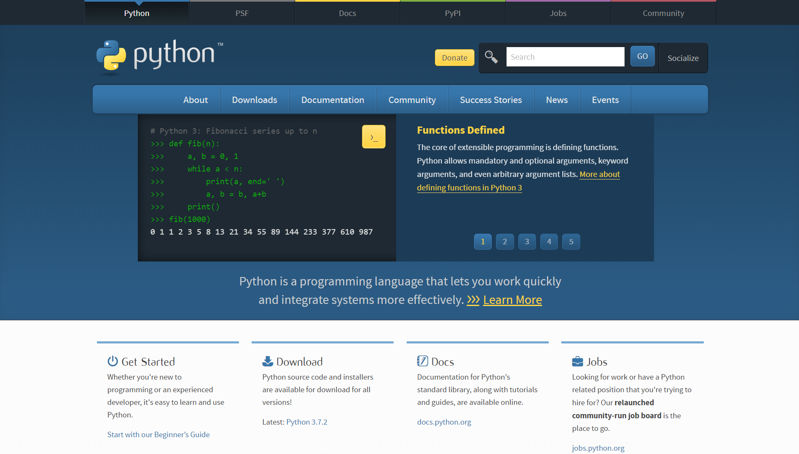
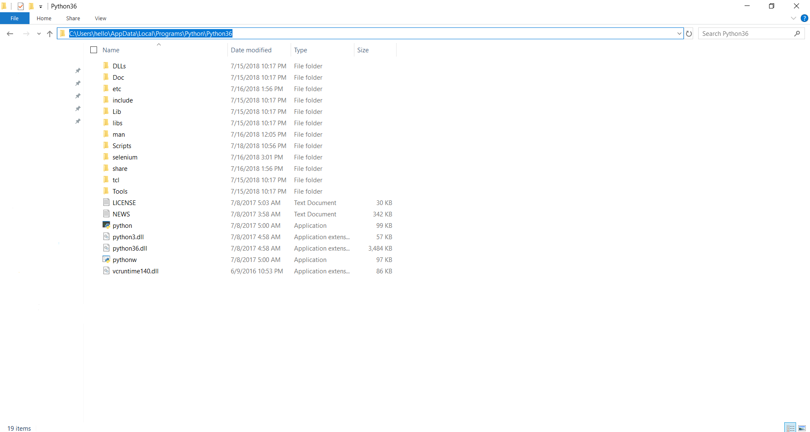
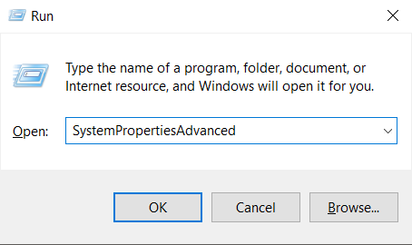
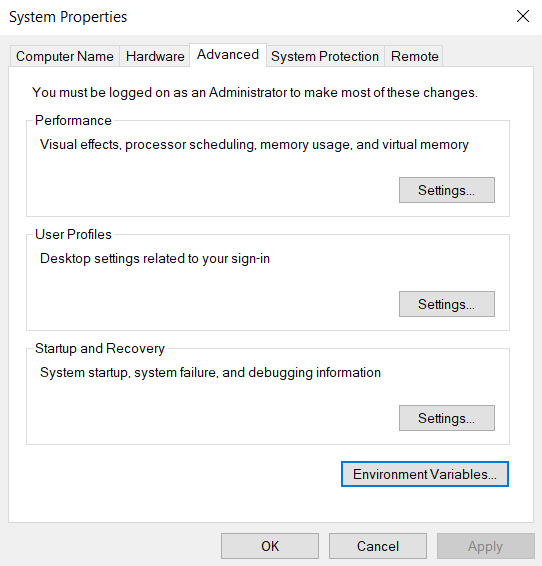
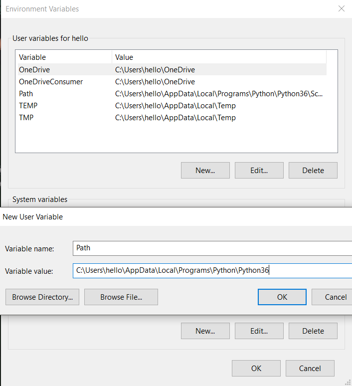
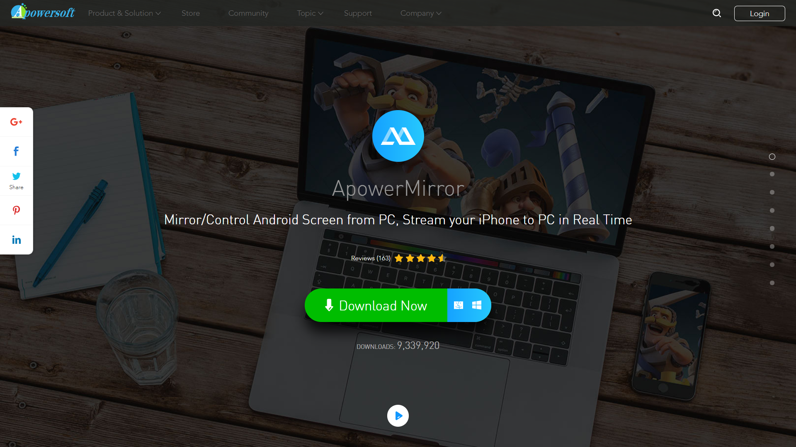
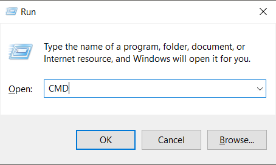
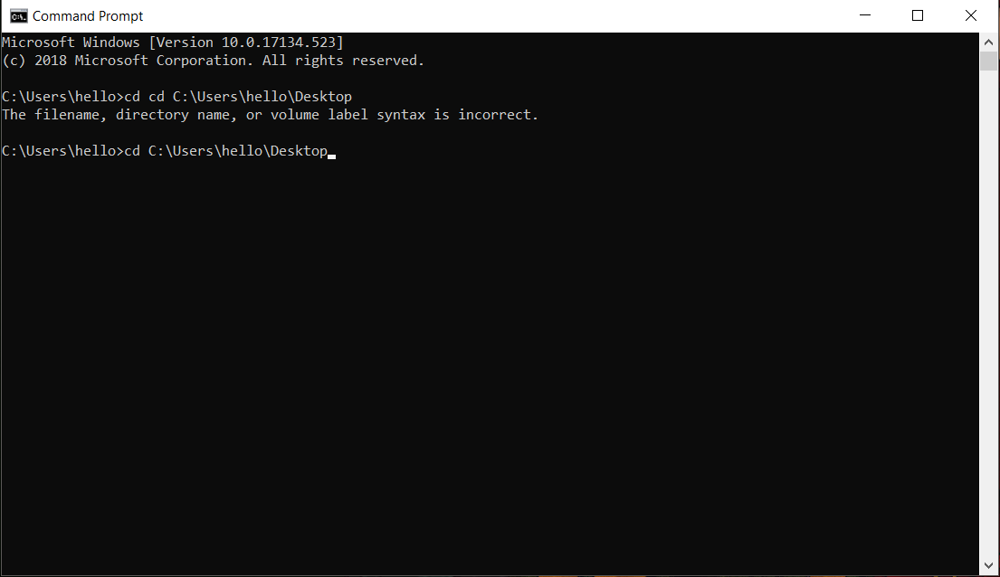
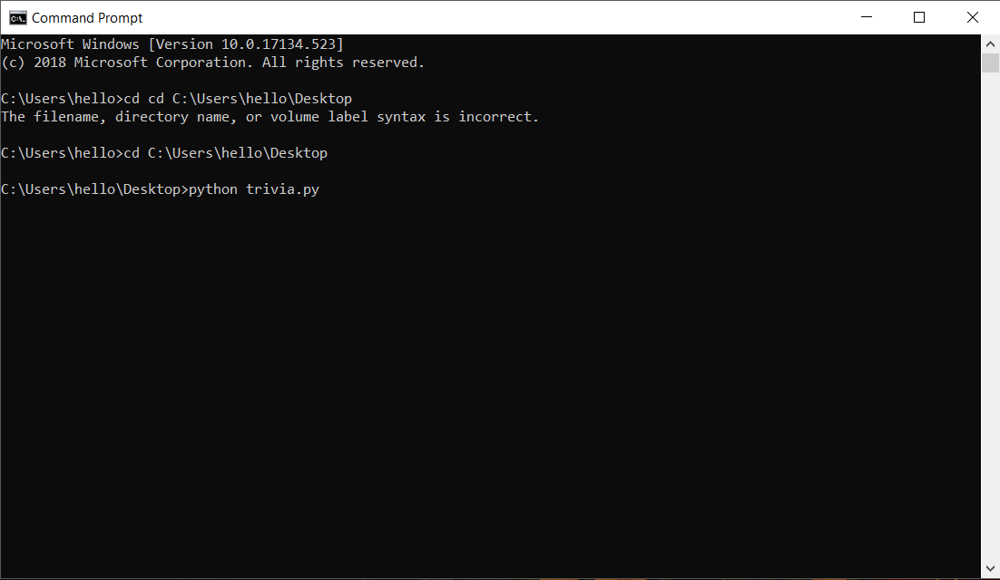
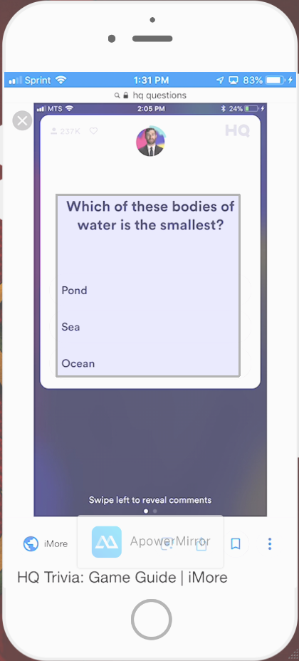

# HQ-Bot
A Web Scraper that Utilizes Google and OCR for Answers on HQ Trivia

# Installation
This script is optimized for both Windows and MacOS.

This version runs off of Python version 3.6 but it should run on any version of Python. This guide will utilize Python 3.6 for ease of instruction.

1.  Download Python 3.6 from https://www.python.org/ and use the installer to install Python to your computer
     
2. After installing Python, locate Python installation at "C:\Users\<Insert Your Username>\AppData\Local\Programs\Python\Python36". Copy this path by selecting and copying as text.
   
3. Open Run on Windows by pressing the "Windows key + R". In the dialog box, type "SystemPropertiesAdvanced".
   
4. In the "System Properties" window, select the "Advanced" window and click "Environment Variables".
   
5. In the "Environment Variables" windows, select "New" in the upper section labeled "User Variables for <Insert Your Username>". In the dialog pox, "Variable Name" is "Path" and "Variable Value" is the the address that was copied in Step 2.
    
6. Clone this repository to your computer and unzip.
 
7. Store the Python fill called "trivia.py" and "key.json" in a place that is easy to access. Keep note of the address of the location of the "trivia.py" and "key.json" files and keep them in the same file location.

# Setup
This script utilizes the internet. Thus, it will be necessary that you are connect to the internet on your PC.

As HQ Trivia is not compatible with PC, a screen mirroring software is used in lieu of local gameplay.

1.  Download ApowerMirror from https://www.apowersoft.com/phone-mirror/ and use the installer to install ApowerMirror to your computer.
     
2. Follow the instructions, dependent on whether you have iOS or Android, and connect so phone/tablet screen is viewable on PC.

3. Open the HQ Trivia app at an applicable show time.

4. Open Run on Windows by pressing the "Windows key + R" and type "CMD". Type "cd <Insert Address of "trivia.py" File>".
    
5. One you're in the folder of the "trivia.py" file, type "python trivia.py" in the the "Command Prompt" window. Move the "Command Prompt" window aside.
     
   
# Usage
1. After opening the "trivia.py" file, the screen should be tinted gray. When the question appears on the screen, select the entirety of the question and the answer choices.
    
2. After the script scraps the internet based on the question and answer choices, the answers will be shown with accuracy percentages next to them, highest being better.
    
3. Type "python trivia.py" in the "Command Prompt" and repeat for all questions.

# DISCLAIMER
This script by no means will provide the correct answer everytime. The success rate is approximately 75%-85%. Some answers that are given may be incorrect due to a multitude of errors.

This publication is intended for informational/educational purposes only.

